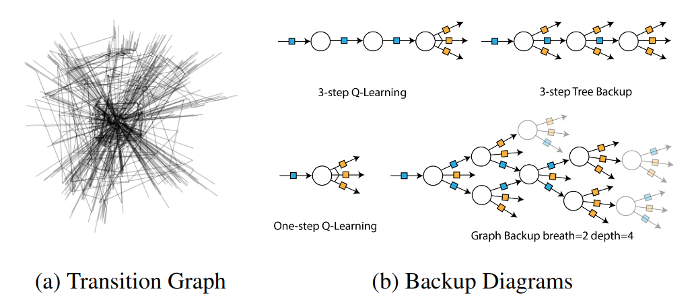

# Implementation of Graph Backup: Data-Efficient Backup Exploiting Markovian Transitions 
Code release for [Graph Backup: Data Efficient Backup Exploiting Markovian Transitions ](https://arxiv.org/abs/2205.15824).

Abstract:
> The successes of deep Reinforcement Learning (RL) are limited to settings where we have a large stream of online experiences, but applying RL in the data-efficient setting with limited access to online interactions is still challenging. A key to data-efficient RL is good value estimation, but current methods in this space fail to fully utilise the structure of the trajectory data gathered from the environment. In this paper, we treat the transition data of the MDP as a graph, and define a novel backup operator, Graph Backup, which exploits this graph structure for better value estimation. Compared to multi-step backup methods such as $n$-step $Q$-Learning and TD($\lambda$), Graph Backup can perform counterfactual credit assignment and gives stable value estimates for a state regardless of which trajectory the state is sampled from. Our method, when combined with popular value-based methods, provides improved performance over one-step and multi-step methods on a suite of data-efficient RL benchmarks including MiniGrid, Minatar and Atari100K. We further analyse the reasons for this performance boost through a novel visualisation of the transition graphs of Atari games. 



The figure above shows the (a) the transition graph of a Atari game, Frostbite; (b) the backup diagrams for different backup methods.


The implementation of vanilla DQN for MiniGrid and MinAtar is based on https://github.com/Kaixhin/Rainbow, under the directory `gridworld` .
The implementation of Rainbow for Atari is based on https://github.com/mila-iqia/spr, under the directory `atari`.

## Install
```bash
conda create -n gb python=3.9
conda activate gb
conda install pytorch torchvision torchaudio cudatoolkit=11.3 -c pytorch
pip install -r requirements.txt
# setup atari ROMS
cd atari
wget http://www.atarimania.com/roms/Roms.rar
unrar x Roms.rar
python -m atari_py.import_roms .
```

## Usage

To run mingrid experiments:

```bash
cd gridworld
python core/run.py --id=T-1-1 --exp_group=T-1 --env=MiniGrid-KeyCorridorS3R1-v0 --num_steps 1000000 --seed=1 --disable_noisy --disable_dist --priority-exponent=0.0 --disable_duelling --disable_noisy --distill_steps=1 --buffer_sample=uniform --initialization=distilled --multi-step=10 --backup_target=graph-limited --buffer_key=transition --branching_limit=50 --backup_target_update --discount=0.95 --learning-rate=0.001
```

To run minatar experiments:
```bash
cd gridworld
python core/run.py --id=T-2-1 --exp_group=T-2 --env=Minatar-seaquest --num_steps 1000000 --seed=1 --disable_noisy --disable_dist --priority-exponent=0.0 --disable_duelling --disable_noisy --distill_steps=1 --buffer_sample=uniform --initialization=distilled --multi-step=5 --backup_target=graph-limited --buffer_key=transition --branching_limit=20 --backup_target_update --hidden-size=256 --learning-rate=0.000065 --learn-start=1600 --target-update=8000 --replay-frequency=4
```

To run atari experiments:
```bash
cd atari 
python scripts/run.py --game=breakout --exp_id=T-3-1 --seed=1 --num-logs=10 --spr=0 --backup=graph --augmentation none --target-augmentation 0 --momentum-tau 0.01 --n-step=10 --breath=10 --architecture=spr --learning_rate=0.0001 --limit_sample_method=uniform
```

## Reference
```
@article{jiang2022graphbackup,
  title={Graph Backup: Data Efficient Backup Exploiting Markovian Transitions},
  author={Zhengyao Jiang and Tianjun Zhang and Robert Kirk and Tim Rocktäschel and Edward Grefenstette},
  journal={arXiv preprint arXiv:2205.15824},
  year={2022},
}
```
